# Carseek Rentals

## Table of Contents

- [Carseek Rentals](#carseek-rentals)
  - [Table of Contents](#table-of-contents)
  - [Overview](#overview)
  - [Design Specification](#design-specification)
    - [Updated Requirements List:](#updated-requirements-list)
    - [System Architecture:](#system-architecture)
    - [E-R Diagram](#e-r-diagram)
    - [Site Map](#site-map)
    - [Wireframes](#wireframes)
  - [Implementation:](#implementation)
  - [System Testing:](#system-testing)

## Overview

CarSeek is a car rental web application where car dealers can post listings of the cars that they wish to rent out and customers can sift through the car catalogue intuitively, sign dynamic rental agreements and report damage/defect in cars if any. When registering to create an account on the website, the user has to specify if he is a customer or a dealer based on which differing level of access and functionalities are granted to the user.
As we started working on this project, we decided to make some adjustments to the original requirements. This includes dropping a payment interface in favour of a dynamic tailor-made rental agreements. We have also scrapped the idea having a star-based rating system of cars and providing insurance coverage to customers.
The URL for the deployed web app is: http://uofglasgowcarseek.pythonanywhere.com/

## Design Specification

### Updated Requirements List:

- The user (Customer) should have the ability to register for an account by providing essential personal details such as their name, address, driver's license, and other relevant information.

- Create a reliable login mechanism that prioritizes the protection of user accounts by implementing authentication techniques such as username/password validation or other secure authentication methods.

- Implement a secure login system with username/password authentication or other authentication methods to ensure user accounts are protected

- The dealer through his account should be able to post listings and details about the car he wishes to rent out on the website.

- The website should include sorting features to enable users to efficiently browse through a diverse selection of cars according to various criteria such as car type (SUV, sedan, limousine, etc.), color, mileage, passenger capacity, price, rating, time period during which the car is available etc.

- After the user places an order for a car, the site should generate a rental agreement. If the user wishes to extend the period of the rental agreement.

- The site should provide a mechanism for users to report damage to the car.

- Upon returning the car to the store, users should have the opportunity to rate the condition of the specific vehicle they utilized, which would then be factored into the average rating of that specific car.

- If users need to communicate with customer representatives for inquiries, feedback, or complaints, they can utilize the website's built-in messenger application to do so.

### System Architecture:

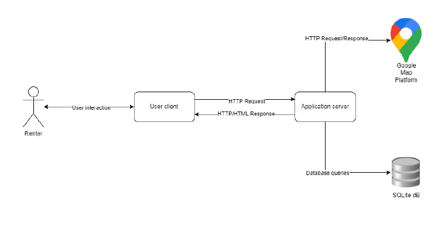

### E-R Diagram

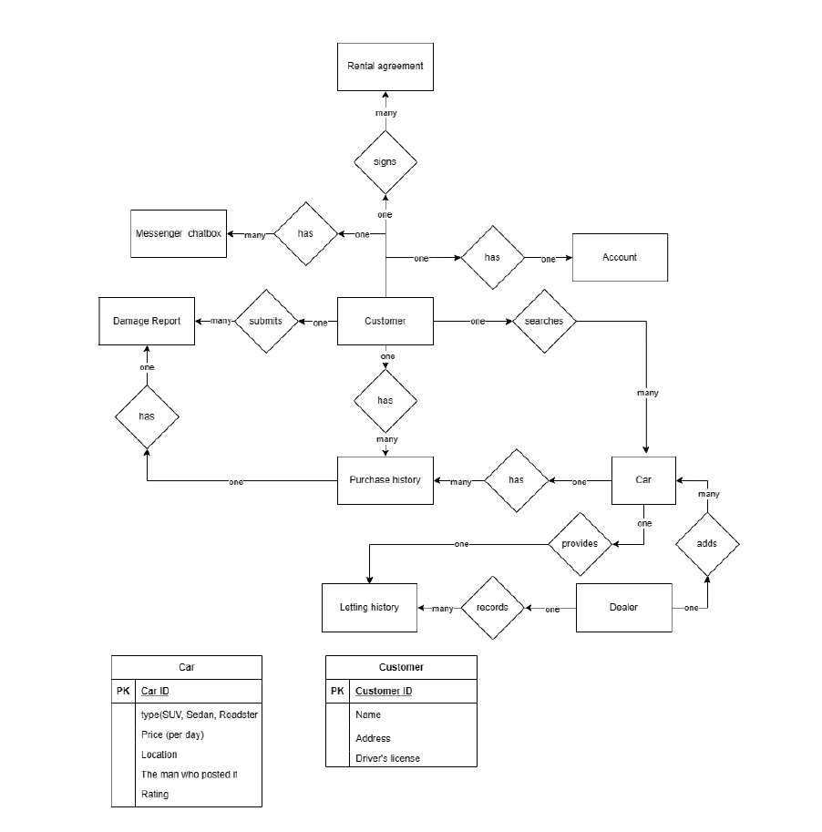

### Site Map

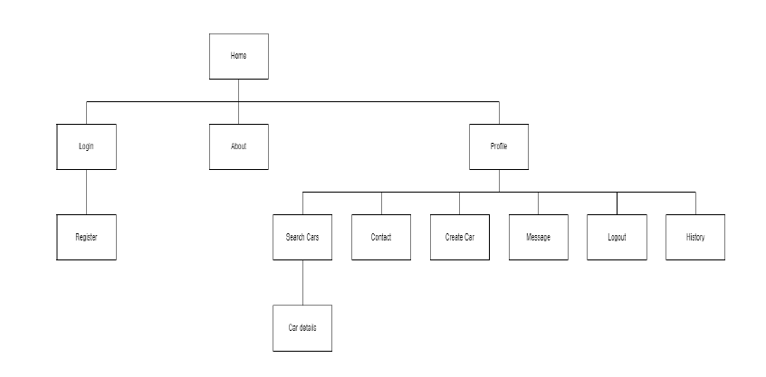

### Wireframes

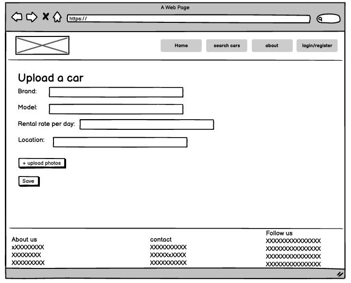
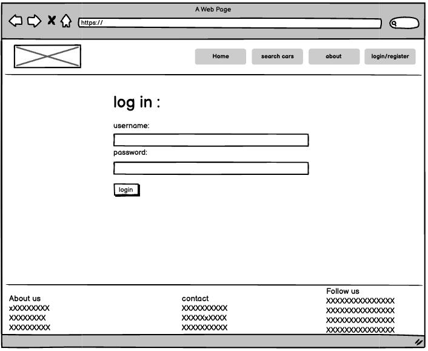
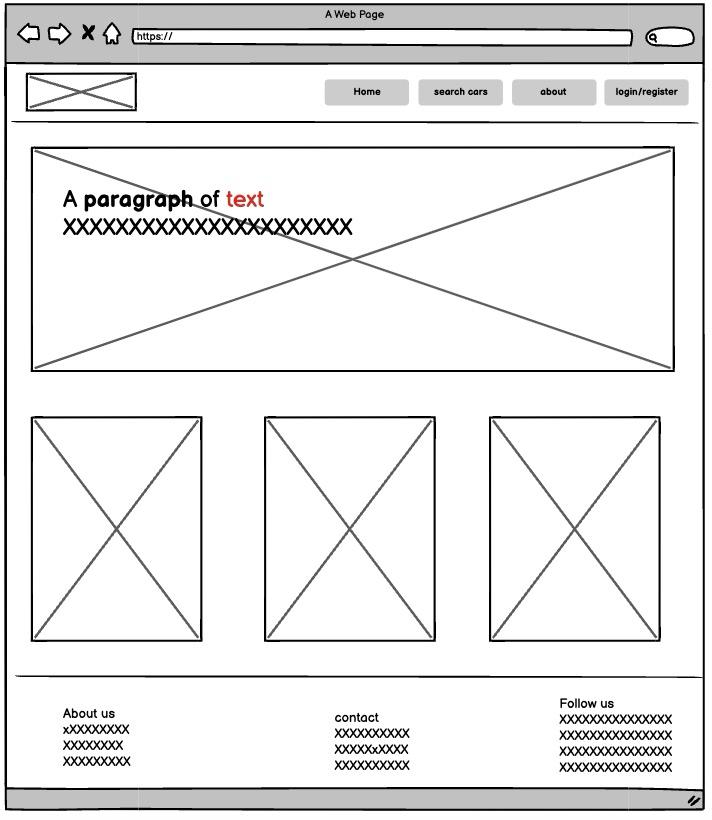
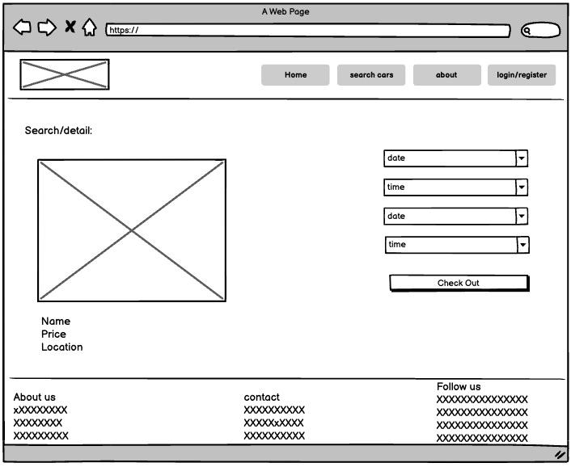
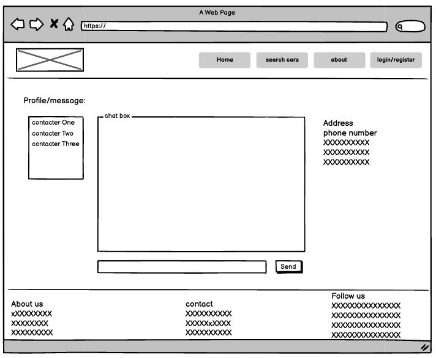
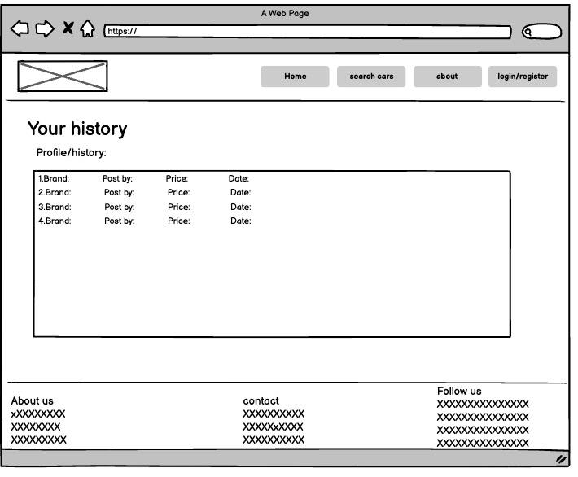
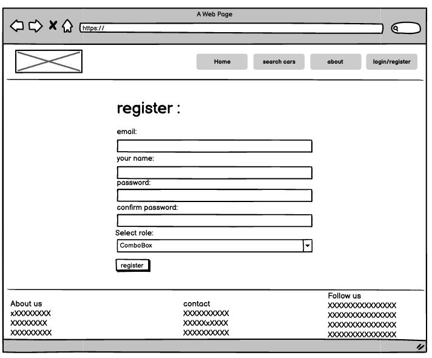
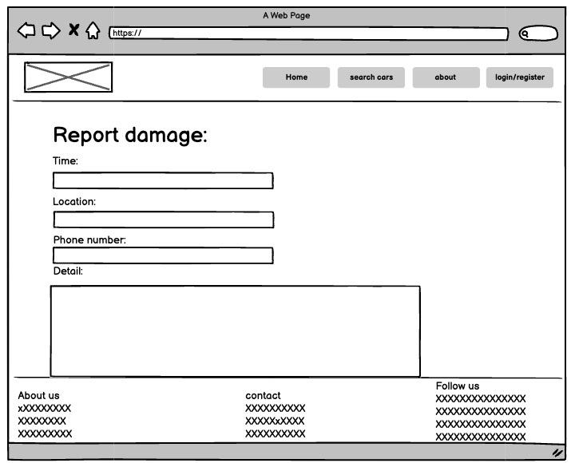
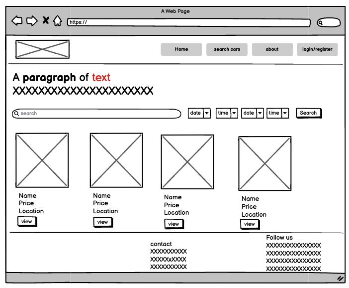

## Implementation:

We believe that the most effective way to explain functionalities and its implementations is through the perusal of the code behind them, which in this context would mean explaining what each View in the codebase does.
The following are the basic views of the app:

1. **Layout view:**
   This renders the template that acts as a foundation for all the other pages that are used in this application. This ensures that all the pages of this application have certain features in common such as navigation bar, headers, footer, among others. This makes use of Django’s shortcuts module to achieve the same. The template used in this view utilises, like many other pages in this app, HTML for structure, CSS for styling and JavaScript for interactivity with the front-end.

2. **home view:**
   This renders the home page of this application, the default page from which the user can gain access to almost every other page of the app. It aims to capture the essence of the website and communicate it to the user in a matter of second via showcasing the site’s features, promotions et cetera in an engaging manner. This is implemented by utilising Django’s Object-Relational Mapping to fetch data related to vehicles and other details, which is then passed onto the home.html for display to the user.

3. **loginPage view:**
   This deals with user authentication to make sure that the users are accessing the right accounts, that is, the accounts that they created. This is achieved by comparing the user’s credentials( username and password) against the corresponding ones stored in the database. If they match, the user is granted access to the account. If not, an error message will be displayed.

4. **logoutUser view:**
   This view stops the current session that the user is on and is then logged out of his account, who is then redirected back to the homepage. This is implemented in a straight forward fashion by using Django’s built-in log out functionality that terminates the current session.

5. **registerPage view:**
   This renders the page where users can provide details about themselves to create user accounts on the website. This view processes user registration form
   submissions, validating the provided data and creating new user accounts in the database if the form data is valid. It leverages Django's user creation form and authentication system to handle user registration securely and efficiently

6. **userProfile view:**
   this renders the user’s own page where he can access relevant details about his account such as username, email, profile picture, and account settings, enabling him to manage and view their profile details. This is achieved by fetching user details from the database and rendering it onto the userProfile.html page

7. **userAbout view:**
   This view renders the information about the website and the company that operates it. This includes the firm’ missions and purpose, among others. This is done by passing the userAbout.html template, which contains descriptive content about the application's background, functionality, and objectives

8. **userHistory view:**
   This view renders the user’s previous transactions and rental agreement to help them review their past activities, spending habits on the website and be informed of their rights and legal obligations. This view retrieves the user's rental history data from the database and passes it to the userHistory.html template for rendering. The template presents the rental history in a structured format, displaying details such as rental dates, car information, rental agreements, and payment records

9. **userContact view:**
   The app allows the users to report damage or defects in the car that they rented or make any complaint that they wish to remedy. This view renders the platform where users can type and submit their grievances in a text box via clicking the submit button, which sends the form data to the backend where it is processed and the apt actions are taken such as notifying the support staff or feeding the damage report in a database et cetera.

10. **generate_pdf view:**
    This view converts HTML-type files into the PDF format so that car rental agreements can be shared, printed or saved by the user. It fetches the relevant details about the rental agreements from the database, transposes it onto an HTML template, which is then rendered and later converted to the PDF format using Django’s xhtml2pdf library. The PDF is then returned to the client’s request as an HTTP response.

11. **searchPage view:**
    This view implements the functionality that allows users to browse cars and sort them by various features such as brand, model, location, rental rate, and availability dates. The search form sends the search queries to this view to process. It then constructs filter conditions based on the user's input, retrieves relevant car data from the database using Django's ORM features, and passes the filtered data to the search.html template for rendering. The template displays search results, allowing users to browse and select cars that meet their requirements.

12. **carDetailsPage view:**
    When a user selects a car, the website shows details about the car such as specifications, rental rates, availability, and options for creating rental agreements. This view implements that by fetching the relevant details from the database by the car’s unique id(primary key) and passes the same to the car_details.html for rendering. Users can also initiate rental agreements directly from this page.

13. **uploadCarDetails view:**
    The website allows authorised car dealer or owners to add their cars to the site’s catalogue for the potential customer to find. This view receives form data for uploading cars from the car owners and then store it in a database.

The following are the two main views from the Messenger app of the website:

1. **CreateTextView(View):**
   Handles creating new chat messages. It receives the message content from the request, associates it with the current user's username (stored in the session), and saves it to the database as a new message

2. **SendText(View):**
   Provides a streaming endpoint for real-time updates of chat messages. It streams existing messages and listens for new messages using asynchronous event handling.

For the messenger app to work, Javascript code (Server Side Events) has to be embedded in the HTML file where the chatbox is located. The JavaScript code serves the following function:

- **Sender:**
  When a user submits a message through the form, the JavaScript code extracts the message content from the form input field and sends it to the server via a POST
  request to the /createTextView/ endpoint. The server then processes this request, associates the message with the current user (sender), and saves it to the database. Therefore, the user who submits the form is considered the sender of the message.

- **Receiver:**
  In the case of server-sent events (SSE), the JavaScript code establishes a connection with the server at the /stream-chat-messages/ endpoint to receive real-time updates about new messages. When the server sends a new message through this SSE connection, the JavaScript code processes the received data and displays it in the chat interface. Since SSE provides updates about all messages in the chat room, the receiver of the message is any client (user) currently connected to the SSE endpoint and viewing the chat interface.

In a nutshell, the JavaScript code identifies the sender as the user who submits a message through the form, while the receiver includes all clients connected to the SSE endpoint and receiving real-time updates about new messages in the chat room.

## System Testing:

The web app has undergone multiple rigorous tests and passed all of them successfully. It is working as well as we expected with the exception of one, namely the messenger app. The messenger app, although worked as a standalone app, did not integrate well with the rest of the website and caused numerous issues. Because of this, we decided it is best not to incorporate the messenger app in the web app. Seeing as building messenger apps are complex, which involves asynchronous functions, web sockets and transposing JSON data form from back end to front, we are quite pleased with what we were able to achieve with regard to the messenger app. Hence, we have added the code for the messenger app in the “scrapped” folder inside the zip file.
We have also successfully deployed the web app on Python Anywhere server.
